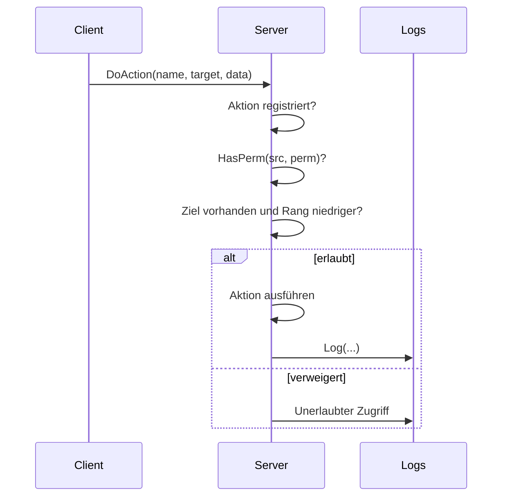

<div align="center">


<h1>TakeAdmin</h1>

<p><strong>Das Admin-Menü für FiveM im klassischen GTA-Look.</strong><br>
Schnell, sicher und vollständig auf Deutsch , mit ESX Legacy oder komplett standalone.</p>

<p>
  
  
  
  
</p>

<p>
  <a href="#schnellstart"><strong>Schnellstart</strong></a> ·
  <a href="#funktionen"><strong>Funktionen</strong></a> ·
  <a href="#rechte"><strong>Rechte</strong></a> ·
  <a href="docs/README.md"><strong>Dokumentation</strong></a> ·
  <a href="../../issues"><strong>Fehler melden</strong></a>
</p>

</div>

<br>

## Warum TakeAdmin?

Viele Admin-Menüs prüfen Rechte nur auf dem Client und sind damit für Cheater ein offenes Tor. TakeAdmin geht einen anderen Weg: **Jede Aktion wird auf dem Server geprüft**, jeder Versuch protokolliert, und kein Teammitglied kann gegen einen höheren Rang vorgehen.

| Merkmal | Beschreibung |
| --- | --- |
| **Serverseitig abgesichert** | Rechte, Ziel und Rang werden bei jeder Aktion zentral auf dem Server geprüft |
| **GTA-Look** | NUI-Menü im Stil des originalen Interaktionsmenüs, bedienbar mit Tastatur |
| **ESX oder Standalone** | Volle ESX-Legacy-Integration, läuft aber auch ohne Framework über ACE |
| **Lückenlose Logs** | Alle Aktionen in der Server-Konsole und optional in Discord |
| **Komplett auf Deutsch** | Oberfläche, Meldungen, Kommentare und Dokumentation |

<br>

## Funktionen

<table>
<tr>
<td width="50%" valign="top">

**Admin-Werkzeuge**
- Noclip und Godmode
- Spectate von Spielern
- Spieler-Blips auf der Karte
- Teleport zu Spielern und Spieler holen
- Aufräumen von Fahrzeugen und Objekten
- Screenshots von Spielern¹

</td>
<td width="50%" valign="top">

**Moderation**
- Banns mit Speicherung in MySQL oder JSON
- Verwarnungen mit Verlauf
- Report-System für Spieler
- Interner Admin-Chat
- Rang-Schutz gegen Missbrauch
- Konsolenbefehle für Bann-Verwaltung

</td>
</tr>
<tr>
<td width="50%" valign="top">

**ESX Legacy**
- Geld und Gruppen verwalten
- Items vergeben²
- Wiederbeleben³
- Hunger und Durst setzen⁴
- Blendet sich ohne ESX automatisch aus

</td>
<td width="50%" valign="top">

**Sicherheit**
- Keine Aktion ohne Serverprüfung
- Unerlaubte Zugriffe werden geloggt
- Eingaben werden validiert
- Geheimnisse bleiben auf dem Server
- Gruppen nur bis zum eigenen Rang vergebbar

</td>
</tr>
</table>

<sub>¹ benötigt `screenshot-basic` · ² `ox_inventory` · ³ `esx_ambulancejob` · ⁴ `esx_basicneeds`</sub>

<br>

## Schnellstart

> [!IMPORTANT]
> TakeAdmin benötigt **OneSync**. Ohne OneSync funktionieren Spectate, Teleport, Blips und das Aufräumen nicht.

**1. Herunterladen**

Lade die neueste Version unter [Releases](../../releases) herunter oder klone das Repository:

```bash
git clone https://github.com/finnconradtc/TakeAdmin.git
```

**2. Einfügen**

Lege den Ordner in `resources/`. Der Ordnername muss exakt `TakeAdmin` lauten.

**3. Starten**

Trage TakeAdmin in der `server.cfg` **nach** seinen Abhängigkeiten ein:

```cfg
ensure oxmysql
ensure es_extended
ensure TakeAdmin
```

**4. Rechte vergeben:** siehe [Rechte](#rechte). Fertig.

<br>

## Abhängigkeiten

| Ressource | Status | Zweck |
| --- | :---: | --- |
| [OneSync](https://docs.fivem.net/docs/scripting-reference/onesync/) | **Pflicht** | Spectate, Teleport, Blips, Aufräumen |
| [oxmysql](https://github.com/overextended/oxmysql) | Empfohlen | Speicherung von Banns und Verwarnungen in MySQL |
| [es_extended](https://github.com/esx-framework/esx_core) | Optional | ESX-Menü und Gruppen |
| [ox_inventory](https://github.com/overextended/ox_inventory) | Optional | Items vergeben |
| [screenshot-basic](https://github.com/citizenfx/screenshot-basic) | Optional | Screenshots von Spielern |
| `esx_ambulancejob` | Optional | Wiederbeleben |
| `esx_basicneeds` | Optional | Hunger und Durst |

<br>

## Rechte

TakeAdmin arbeitet mit **Levels**. Jede Gruppe hat ein Level, jede Funktion ein Mindest-Level in `Config.Permissions`.

| Gruppe | Level | ACE-Recht |
| --- | :---: | --- |
| `superadmin` | **100** | `takeadmin.superadmin` |
| `admin` | **80** | `takeadmin.admin` |
| `mod` | **50** | `takeadmin.mod` |
| `support` | **20** | `takeadmin.support` |

Das Level stammt aus der **ESX-Gruppe** oder aus **ACE**. Gilt beides, zählt das höhere.

<details>
<summary><strong>Rechte per ACE vergeben</strong></summary>

<br>

```cfg
# Gruppe mit TakeAdmin-Recht verknüpfen
add_ace group.admin takeadmin.admin allow

# Spieler der Gruppe zuweisen
add_principal identifier.license:DEINE_LICENSE group.admin
```

</details>

<details>
<summary><strong>Rechte per ESX vergeben</strong></summary>

<br>

Gib dem Spieler einfach die passende ESX-Gruppe, zum Beispiel `admin`. TakeAdmin liest sie automatisch über `xPlayer.getGroup()` aus.

</details>

> [!NOTE]
> **Rang-Schutz:** Aktionen gegen Spieler mit höherem Rang werden abgelehnt, und niemand kann eine Gruppe über dem eigenen Rang vergeben.

<br>

## Befehle

| Befehl | Ort | Beschreibung |
| --- | :---: | --- |
| `/report <Text>` | Ingame | Meldung an das Team senden |
| `/a <Text>` | Ingame | Nachricht im Admin-Chat |
| `ta_bans` | Konsole | Alle aktiven Banns anzeigen |
| `ta_unban <ID>` | Konsole | Bann aufheben |

Taste und Befehl zum Öffnen des Menüs legst du in `config.lua` fest.

<br>

## Konfiguration

| Datei | Inhalt | Für Clients lesbar |
| --- | --- | :---: |
| `config.lua` | Gruppen, Rechte, Tasten, Listen | Ja |
| `server/sv_config.lua` | Discord-Webhook und andere Geheimnisse | Nein |

> [!WARNING]
> `config.lua` wird an alle Clients gesendet. Trage **niemals** Webhooks, Tokens oder Passwörter dort ein.

<details>
<summary><strong>Discord-Logs einrichten</strong></summary>

<br>

1. In Discord: Kanal-Einstellungen → Integrationen → Webhooks → Neuer Webhook
2. Webhook-URL kopieren
3. In `server/sv_config.lua` eintragen
4. `restart TakeAdmin`

</details>

<details>
<summary><strong>Speicherung von Banns und Verwarnungen</strong></summary>

<br>

| Mit `oxmysql` | Ohne `oxmysql` |
| --- | --- |
| Tabellen `takeadmin_bans` und `takeadmin_warns` | Dateien `data/bans.json` und `data/warns.json` |
| werden beim ersten Start automatisch angelegt | werden automatisch genutzt |

</details>

<br>

## Häufige Fragen

<details>
<summary><strong>Das Menü öffnet sich nicht.</strong></summary>
<br>
Prüfe, ob du eine Gruppe mit Rechten hast (ESX oder ACE) und ob <code>ensure TakeAdmin</code> nach den Abhängigkeiten steht.
</details>

<details>
<summary><strong>Spectate, Teleport oder Blips funktionieren nicht.</strong></summary>
<br>
OneSync ist nicht aktiv. Aktiviere es in txAdmin oder per <code>set onesync on</code> in der <code>server.cfg</code>.
</details>

<details>
<summary><strong>Das ESX-Menü fehlt.</strong></summary>
<br>
<code>es_extended</code> läuft nicht oder startet erst nach TakeAdmin.
</details>

<details>
<summary><strong>Die Oberfläche zeigt noch die alte Version.</strong></summary>
<br>
Verbinde dich einmal neu, der FiveM-Cache hält die alte NUI fest.
</details>

<details>
<summary><strong>Banns landen nicht in der Datenbank.</strong></summary>
<br>
<code>oxmysql</code> fehlt oder startet nach TakeAdmin. In diesem Fall wird automatisch <code>data/bans.json</code> genutzt.
</details>

<details>
<summary><strong>Ich kann einen bestimmten Spieler nicht bannen.</strong></summary>
<br>
Der Spieler hat einen höheren Rang als du. Das ist der Rang-Schutz und gewollt.
</details>

<br>

## Für Entwickler

<details>
<summary><strong>Projektstruktur</strong></summary>

<br>

```
TakeAdmin/
├── fxmanifest.lua        Ladereihenfolge der Skripte
├── config.lua            Shared-Config: Gruppen, Rechte, Tasten, Listen
├── client/
│   ├── utils.lua         TriggerCallback, DoAction, Notify, Teleport
│   ├── menu.lua          Menü-Engine und Item-Bausteine
│   ├── menus.lua         Alle Menüs und Untermenüs
│   ├── features.lua      Noclip, Godmode, Spectate, Blips
│   └── main.lua          Öffnen per Taste/Befehl, NUI-Init
├── server/
│   ├── sv_config.lua     Geheimnisse (Discord-Webhook)
│   ├── utils.lua         GetLevel, HasPerm, Log, RegisterCallback
│   ├── bans.lua          Banns und Verwarnungen
│   └── main.lua          Callbacks, Aktionen, Befehle
├── html/                 NUI-Oberfläche
├── data/                 JSON-Speicher
└── docs/                 Dokumentation
```

</details>

<details>
<summary><strong>Ablauf einer Aktion</strong></summary>

<br>



</details>

<details>
<summary><strong>Neue Funktion hinzufügen</strong></summary>

<br>

1. Recht mit Level in `Config.Permissions` eintragen
2. Serverseitig mit `Action(name, perm, needsTarget, fn)` registrieren
3. Alle Eingaben prüfen (`tonumber`, `Trim(s, max)`)
4. Aktion mit `Log(...)` protokollieren
5. Menüeintrag mit `Can('<perm>')` ausblenden
6. Neue Dateien in `fxmanifest.lua` eintragen, Doku aktualisieren

> `Can()` blendet nur aus. Die eigentliche Sicherheit kommt **immer** vom Server.

Ausführlich mit Codebeispiel: [docs/entwicklung.md](docs/entwicklung.md)

</details>

<details>
<summary><strong>Testen</strong></summary>

<br>

```bash
# JavaScript prüfen
node --check html/script.js

# Lua-Syntax prüfen
npm i luaparse
node -e "require('luaparse').parse(require('fs').readFileSync('server/main.lua','utf8'),{luaVersion:'5.3'});console.log('OK')"
```

Im Spiel mit `restart TakeAdmin` testen. Nach NUI-Änderungen einmal neu verbinden.

</details>

<br>

## Mitmachen

Beiträge sind willkommen. So gehst du vor:

1. Repository forken
2. Branch anlegen: `git checkout -b feat/meine-funktion`
3. Änderungen committen: `git commit -m "feat: meine Funktion"`
4. Pushen und einen Pull Request öffnen

Bitte beachte die Regeln unter [Für Entwickler](#für-entwickler) und schreibe Texte und Kommentare auf Deutsch. Fehler und Ideen gerne als [Issue](../../issues).

<br>

## Lizenz

TakeAdmin steht unter einer **eigenen Lizenz**.
Kostenlos nutzbar auf eigenen Servern. Verkauf, Reupload und das Entfernen der Credits sind nicht gestattet.

Die vollständigen Bedingungen stehen in der Datei [`LICENSE`](LICENSE).

<br>

---

<div align="center">

**TakeAdmin** wird entwickelt von [**finnconradtc**](https://github.com/finnconradtc)

Wenn dir TakeAdmin gefällt, freue ich mich über einen Stern auf GitHub.

</div>
