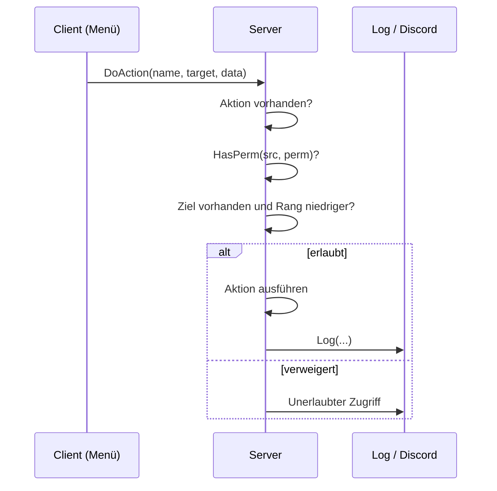

<div align="center">


# TakeAdmin

**Admin-Menü für FiveM im klassischen GTA-Look**
ESX Legacy · Standalone · Rechtesystem mit Rang-Schutz · Banns · Discord-Logs


</div>

---

## Inhalt

- [Funktionen](#funktionen)
- [Voraussetzungen](#voraussetzungen)
- [Installation](#installation)
- [Konfiguration](#konfiguration)
- [Rechte](#rechte)
- [Befehle](#befehle)
- [Speicherung](#speicherung)
- [Aufbau](#aufbau)
- [Für Entwickler](#für-entwickler)
- [Testen](#testen)
- [FAQ](#faq)
- [Mitmachen](#mitmachen)
- [Lizenz](#lizenz)

---

## Funktionen

**Admin-Werkzeuge**
- Noclip, Godmode, Spectate und Spieler-Blips auf der Karte
- Teleport zu Spielern und Spieler zu sich holen
- Aufräumen von Fahrzeugen und Objekten
- Screenshots von Spielern (mit `screenshot-basic`)

**Moderation**
- Banns und Verwarnungen, gespeichert in MySQL oder JSON
- Report-System für Spieler und Admin-Chat für das Team
- Rang-Schutz: niemand kann gegen höhere Ränge vorgehen

**ESX Legacy**
- Eigenes ESX-Menü, z. B. Geld, Gruppen, Items, Wiederbeleben, Hunger und Durst
- Blendet sich automatisch aus, wenn kein ESX läuft

**Sicherheit und Logs**
- Jede Aktion wird auf dem Server geprüft, nie nur auf dem Client
- Unerlaubte Zugriffsversuche werden protokolliert
- Logs in die Server-Konsole und optional an einen Discord-Webhook

**Oberfläche**
- NUI-Menü im GTA-Stil mit Banner, Schrift Lexend Deca, Untermenüs, Checkboxen, Listen und Slidern
- Alle Texte auf Deutsch

---

## Voraussetzungen

| Ressource | Status | Wofür |
| --- | --- | --- |
| OneSync | **Pflicht** | Spectate, Teleport, Blips, Aufräumen |
| `es_extended` | Optional | ESX-Funktionen |
| `oxmysql` | Empfohlen | Banns und Verwarnungen in MySQL |
| `screenshot-basic` | Optional | Screenshots von Spielern |
| `esx_ambulancejob` | Optional | Wiederbeleben |
| `esx_basicneeds` | Optional | Hunger und Durst |
| `ox_inventory` | Optional | Items |

---

## Installation

1. Neueste Version unter [Releases](../../releases) herunterladen oder das Repo klonen:
   ```bash
   git clone https://github.com/finnconradtc/TakeAdmin.git
   ```
2. Den Ordner `TakeAdmin` in den `resources`-Ordner des Servers legen. Der Ordner muss genau `TakeAdmin` heißen.
3. In der `server.cfg` **nach** den Abhängigkeiten eintragen:
   ```cfg
   ensure oxmysql
   ensure es_extended
   ensure TakeAdmin
   ```
4. Rechte vergeben (siehe [Rechte](#rechte)).
5. Server neu starten oder `restart TakeAdmin` ausführen.

> **Ohne ESX:** TakeAdmin läuft auch standalone. Rechte kommen dann nur über ACE, und das ESX-Menü wird ausgeblendet.

---

## Konfiguration

| Datei | Inhalt | Für Clients sichtbar |
| --- | --- | --- |
| `config.lua` | Gruppen, Rechte, Tasten, Listen | Ja |
| `server/sv_config.lua` | Geheimnisse wie der Discord-Webhook | Nein |

> **Wichtig:** `config.lua` kann jeder Spieler auslesen. Webhooks und andere Geheimnisse gehören nur in `server/sv_config.lua`.

**Discord-Logs einrichten:** In Discord unter Kanal-Einstellungen → Integrationen → Webhooks einen Webhook erstellen und die URL in `server/sv_config.lua` eintragen.

**Taste und Befehl zum Öffnen** stellst du in `config.lua` ein.

---

## Rechte

Jede Gruppe hat ein Level, jede Funktion ein Mindest-Level. Wer das Level erreicht, darf die Funktion nutzen.

| Gruppe | Level | ACE-Recht |
| --- | --- | --- |
| superadmin | 100 | `takeadmin.superadmin` |
| admin | 80 | `takeadmin.admin` |
| mod | 50 | `takeadmin.mod` |
| support | 20 | `takeadmin.support` |

- Gruppen stehen in `Config.Groups`, die Mindest-Levels pro Funktion in `Config.Permissions`.
- Das Level kommt aus der ESX-Gruppe oder aus ACE. Gilt beides, zählt das höhere.
- Niemand kann eine höhere Gruppe vergeben als die eigene.

**Rechte per ACE vergeben** (`server.cfg`):

```cfg
add_ace group.admin takeadmin.admin allow
add_principal identifier.license:DEINE_LICENSE group.admin
```

**Mit ESX** reicht es, dem Spieler die passende Gruppe zu geben, z. B. `admin`.

---

## Befehle

| Befehl | Wo | Beschreibung |
| --- | --- | --- |
| `/report <Text>` | Ingame | Meldung an das Team senden |
| `/a <Text>` | Ingame | Admin-Chat für das Team |
| `ta_bans` | Konsole | Alle Banns anzeigen |
| `ta_unban <ID>` | Konsole | Bann aufheben |

---

## Speicherung

| Mit `oxmysql` | Ohne `oxmysql` |
| --- | --- |
| Tabellen `takeadmin_bans` und `takeadmin_warns`, werden automatisch angelegt | Dateien `data/bans.json` und `data/warns.json` |

---

## Aufbau

```
fxmanifest.lua        Ladereihenfolge der Skripte
config.lua            Shared-Config: Gruppen, Rechte, Tasten, Listen
client/
  utils.lua           TriggerCallback, DoAction, Notify, KeyboardInput, Teleport
  menu.lua            Menü-Engine und Item-Bausteine
  menus.lua           Alle Menüs und Untermenüs
  features.lua        Noclip, Godmode, Spectate, Blips
  main.lua            Öffnen per Taste/Befehl, NUI-Init
server/
  sv_config.lua       Geheimnisse (Discord-Webhook)
  utils.lua           GetLevel, HasPerm, Log, Notify, RegisterCallback
  bans.lua            Banns und Verwarnungen
  main.lua            Callbacks, Aktionen, Befehle
html/                 NUI: index.html, style.css, script.js, banner.png, fonts/
data/                 JSON-Speicher für Banns und Verwarnungen
docs/                 Ausführliche Dokumentation
```

---

## Für Entwickler

### So läuft eine Aktion ab



- **Menüs:** Funktionen, die `{ subtitle, items, refresh }` zurückgeben. Bausteine: `Button`, `Sub`, `Checkbox`, `List`, `Slider`, `Separator`.
- **Aktionen:** Client ruft `DoAction(...)`, Server registriert mit `Action(name, perm, needsTarget, fn)`.
- **Daten abfragen:** `TriggerCallback(name, ...)` auf dem Client, `RegisterCallback(name, fn)` auf dem Server.
- **NUI:** `SendNUIMessage({ action = ... })`, verarbeitet in `html/script.js`.
- **Logs:** `Log(src, action, target, details, color)`.

### Neue Funktion hinzufügen

1. Recht in `Config.Permissions` eintragen.
2. Auf dem Server eine `Action(...)` registrieren. **Nie dem Client vertrauen.**
3. Eingaben prüfen (`tonumber`, `Trim(s, max)`).
4. Aktion mit `Log(...)` protokollieren.
5. Menüeintrag im Client mit `Can('<perm>')` absichern. Das blendet nur aus, die Sicherheit kommt vom Server.
6. Neue Dateien in `fxmanifest.lua` eintragen und die Doku aktualisieren.

Mehr Details mit Beispiel: [docs/entwicklung.md](docs/entwicklung.md)

---

## Testen

```bash
# JavaScript prüfen
node --check html/script.js

# Lua-Syntax prüfen
npm i luaparse
node -e "require('luaparse').parse(require('fs').readFileSync('server/main.lua','utf8'),{luaVersion:'5.3'});console.log('OK')"
```

Richtig getestet wird im Spiel mit `restart TakeAdmin`. Nach Änderungen an der NUI einmal neu verbinden, sonst zeigt der Cache die alte Version.

---

## FAQ

**Das Menü öffnet sich nicht.**
Prüfe, ob du ein Recht hast (ESX-Gruppe oder ACE) und ob `ensure TakeAdmin` nach den Abhängigkeiten steht.

**Spectate, Teleport oder Blips gehen nicht.**
OneSync ist nicht aktiv. In der `server.cfg` `set onesync on` setzen.

**Das ESX-Menü fehlt.**
`es_extended` läuft nicht oder startet nach TakeAdmin.

**Die Oberfläche zeigt noch die alte Version.**
Einmal neu verbinden, der FiveM-Cache hält die alte NUI fest.

**Banns werden nicht in der Datenbank gespeichert.**
`oxmysql` fehlt oder startet nach TakeAdmin. Ohne `oxmysql` landen Banns in `data/bans.json`.

**Ich kann einen Spieler nicht bannen.**
Der Spieler hat einen höheren Rang als du. Das ist der Rang-Schutz.

---

## Mitmachen

Fehler gefunden oder eine Idee? Erstell ein [Issue](../../issues) oder einen Pull Request.
Bitte halte dich an die Regeln aus [Für Entwickler](#für-entwickler) und schreibe Texte und Kommentare auf Deutsch.

---

## Lizenz

TakeAdmin steht unter einer eigenen Lizenz. Die Nutzung auf eigenen Servern ist kostenlos, Verkauf und Reupload sind nicht erlaubt.
Alle Bedingungen findest du in der Datei [LICENSE](LICENSE).

<div align="center">

Made by **[finnconradtc](https://github.com/finnconradtc)**

</div>
